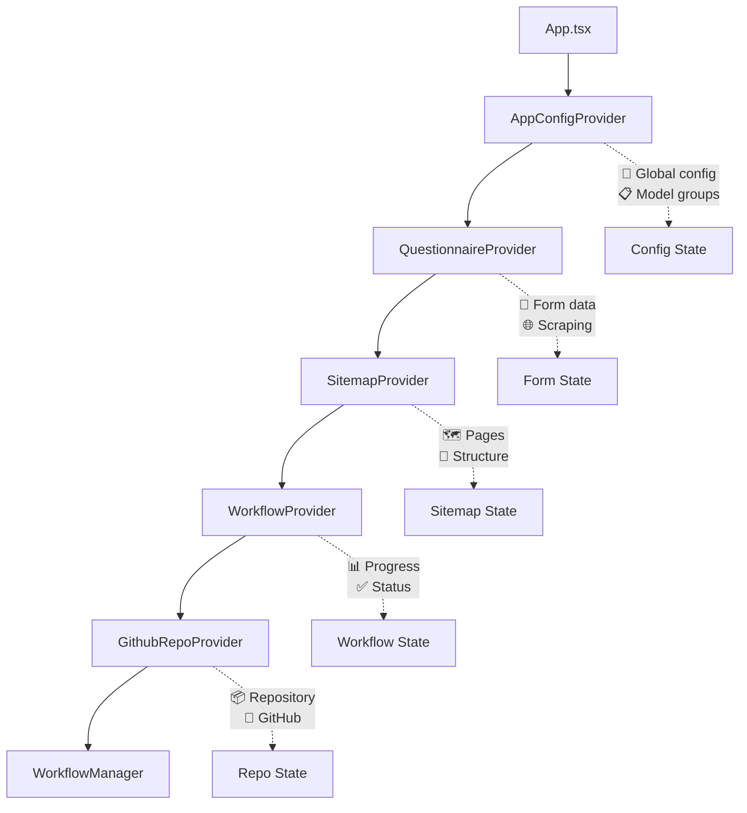
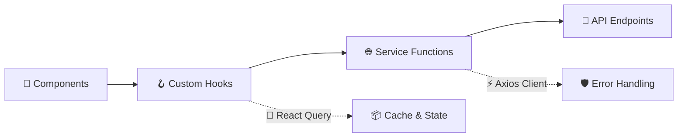
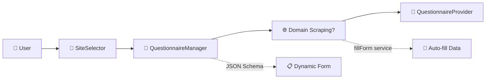
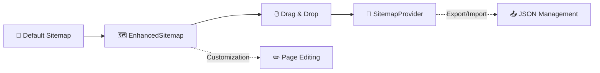
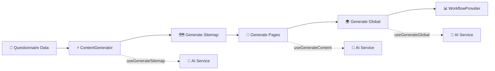
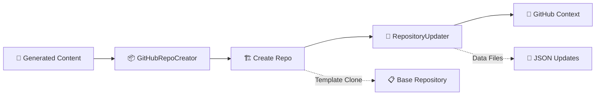
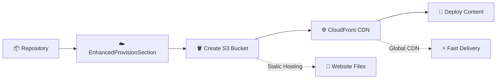
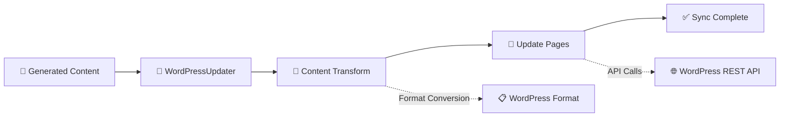
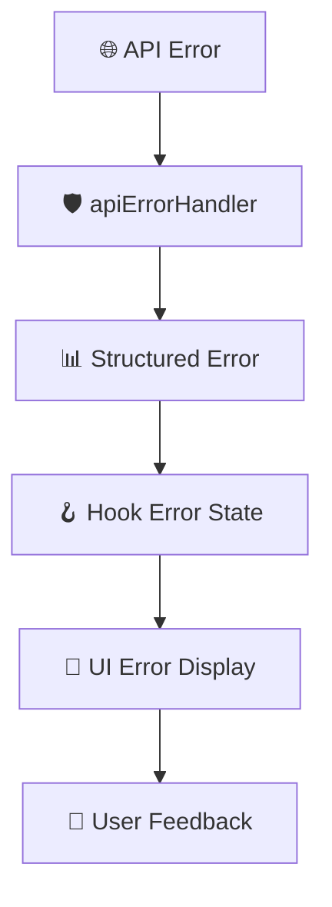

# 🏗️ Template Manager UI - Codebase Documentation

## 📋 Table of Contents
1. [🔍 Overview](#-overview)
2. [🏛️ Architecture](#️-architecture)
3. [🧩 Core Components](#-core-components)
4. [🔄 State Management](#-state-management)
5. [🌐 Data Flow & API](#-data-flow--api)
6. [🎨 Template System](#-template-system)
7. [🧪 Testing](#-testing)
8. [⚙️ Build & Development](#️-build--development)
9. [🔄 Key Workflows](#-key-workflows)
10. [📝 Development Guidelines](#-development-guidelines)
11. [🚀 Future Considerations](#-future-considerations)

---

## 🔍 Overview

The Template Manager UI is a **React-based web application** that enables users to generate website templates for orthodontic practices. It provides a complete workflow from questionnaire completion through site provisioning.

### 🎯 What It Does
- ✅ **Questionnaire Management** - Dynamic forms with domain scraping
- ✅ **Sitemap Building** - Drag-and-drop page organization
- ✅ **Content Generation** - AI-powered content creation
- ✅ **GitHub Integration** - Repository creation and updates
- ✅ **Site Provisioning** - AWS S3/CloudFront deployment
- ✅ **WordPress Sync** - Content synchronization

### 🛠️ Tech Stack
| Technology | Version | Purpose |
|------------|---------|---------|
| **React** | 18.3.1 | UI Framework with TypeScript |
| **Vite** | 5.4.1 | Build tooling and dev server |
| **Sass** | - | Styling with BEM methodology |
| **React Query** | 5.74.11 | Server state management |
| **React Hook Form** | - | Dynamic forms with JSON Schema |
| **React DnD** | 16.0.1 | Drag-and-drop functionality |
| **Vitest** | 3.2.4 | Testing framework |

---

## 🏛️ Architecture

### 📱 Application Structure

The app uses a **provider-wrapper pattern** with multiple context providers managing different aspects of state:



### 📁 Directory Structure

| Directory | Purpose | Key Files |
|-----------|---------|-----------|
| **📂 components/** | React components by feature | `WorkflowManager/`, `QuestionnaireForm/`, `Sitemap/` |
| **🔄 contexts/** | React Context providers | `*Provider.tsx` files |
| **🪝 hooks/** | Custom hooks for logic | `use*.ts` files |
| **🌐 services/** | API service layer | `*Service.ts` files |
| **📐 types/** | TypeScript definitions | `*Types.ts` files |
| **🛠️ utils/** | Utility functions | Helper functions |
| **⚙️ config/** | Configuration files | App settings |
| **🧪 test/** | Test utilities | Setup and helpers |

<details>
<summary>📂 <strong>Detailed Directory Tree</strong></summary>

```
src/
├── 📱 components/           # React components organized by feature
│   ├── 🔄 WorkflowManager/  # Main workflow orchestration
│   ├── 📝 QuestionnaireForm/# Dynamic form generation  
│   ├── 🗺️ Sitemap/         # Sitemap builder with drag-drop
│   ├── 🤝 Common/          # Shared UI components
│   └── 🎨 [FeatureComponents]/
├── 🔄 contexts/            # React Context providers for state
├── 🪝 hooks/               # Custom hooks for data fetching/logic
├── 🌐 services/            # API service layer
├── 📐 types/               # TypeScript type definitions
├── 🛠️ utils/               # Utility functions
├── ⚙️ config/              # Configuration files
└── 🧪 test/                # Test utilities and setup
```
</details>

---

## 🧩 Core Components

### 🎛️ 1. WorkflowManager
> **Location:** `src/components/WorkflowManager/`  
> **Purpose:** Main orchestrator component that manages the entire workflow

| Component | Purpose | Key Features |
|-----------|---------|--------------|
| **🎛️ WorkflowManager.tsx** | Main orchestrator | Sidebar navigation, workflow coordination |
| **🗺️ EnhancedSitemap.tsx** | Sitemap management | Interactive sitemap interface |
| **⚡ ContentGenerator.tsx** | Content generation | AI content creation coordination |
| **📦 GitHubRepoCreator.tsx** | Repository creation | GitHub template repo creation |
| **🔄 RepositoryUpdater.tsx** | Data file updates | GitHub data file management |
| **📝 WordPressUpdater.tsx** | WordPress sync | Content synchronization |
| **☁️ EnhancedProvisionSection.tsx** | AWS provisioning | S3/CloudFront deployment |

<details>
<summary>🔍 <strong>WorkflowManager Deep Dive</strong></summary>

**Core Responsibilities:**
- ✅ Renders different workflow sections based on current step
- ✅ Manages sidebar navigation state  
- ✅ Coordinates between questionnaire, sitemap, and provisioning phases
- ✅ Handles data flow between major sections

**State Dependencies:**
- Uses all context providers for comprehensive state management
- Manages local state for sidebar collapse and provisional data
- Coordinates progress tracking across workflow steps

</details>

---

### 📝 2. QuestionnaireManager  
> **Location:** `src/components/QuestionnaireManager/`  
> **Purpose:** Dynamic form generation and management using JSON Schema

**🌟 Key Features:**
- ✅ **React Hook Form** with JSON Schema validation
- ✅ **Domain Scraping** functionality for pre-filling data  
- ✅ **Multiple Modes** (manual, scraped, template-based)
- ✅ **Custom Field Templates** for enhanced UX

| File | Purpose |
|------|---------|
| `QuestionnaireManager.tsx` | Main form controller |
| `QuestionnaireForm.tsx` | Form rendering logic |
| `schema.ts` | JSON Schema definitions |
| `mockScrape.ts` | Development testing data |

---

### 🗺️ 3. Sitemap Components
> **Location:** `src/components/Sitemap/`  
> **Purpose:** Interactive sitemap builder with drag-and-drop functionality

**🎯 Core Components:**

| Component | Purpose | Features |
|-----------|---------|----------|
| **🖼️ SitemapDualView.tsx** | Main interface | Split view, drag-drop |
| **📄 PageCard.tsx** | Page representation | Individual page cards |
| **🔗 SitemapItem.tsx** | Draggable items | DnD functionality |
| **📤 JsonExportImport.tsx** | Data management | Import/export JSON |
| **⚙️ LayoutControls.tsx** | View controls | Toggle layouts |

<details>
<summary>🎨 <strong>Sitemap Builder Features</strong></summary>

**User Interactions:**
- 🖱️ **Drag & Drop** - Reorder pages and sections
- 👁️ **View Modes** - Compact vs expanded views  
- 📤 **Export/Import** - JSON sitemap data management
- ✏️ **Inline Editing** - Direct page content editing
- 🔄 **Real-time Preview** - Live sitemap visualization

</details>

---

## 🔄 State Management

### 🎯 Context Providers Overview

Each provider manages a specific domain of application state using React Context and useReducer patterns:

| Provider | Domain | Key Responsibilities |
|----------|--------|---------------------|
| **🔧 AppConfigProvider** | Global Config | Template selection, UI settings |
| **📝 QuestionnaireProvider** | Form Data | Survey data, scraping results |
| **🗺️ SitemapProvider** | Page Structure | Sitemap pages, navigation |
| **📊 WorkflowProvider** | Progress Tracking | Step completion, status |

---

### 🔧 1. AppConfigProvider
> **File:** `src/contexts/AppConfigProvider.tsx`  
> **Purpose:** Global app configuration and template management

**📊 State Structure:**
```typescript
{
  selectedModelGroupKey: string    // Currently selected template
  modelGroups: ModelGroup[]        // Available template configurations  
  uiSettings: UIPreferences        // UI preferences and settings
}
```

**🎯 Key Actions:**
- Template selection and switching
- UI preference management
- Model group configuration

---

### 📝 2. QuestionnaireProvider  
> **File:** `src/contexts/QuestionnaireProvider.tsx`  
> **Purpose:** Form data and questionnaire workflow management

**📊 State Structure:**
```typescript
{
  data: FormData                   // Form field values
  mode: QuestionnaireMode          // Current questionnaire mode
  dataSource: DataSourceType       // Data source (manual/scraped)
  scrapeData: ScrapedData          // Domain-scraped data
  isLoading: boolean               // Loading state
  error: string | null             // Error messages
}
```

**🎯 Key Actions:**
- Form data updates and validation
- Domain scraping coordination  
- Mode switching (manual/scraped/template)

---

### 🗺️ 3. SitemapProvider
> **File:** `src/contexts/SitemapProvider.tsx`  
> **Purpose:** Sitemap structure and page management

**📊 State Structure:**
```typescript
{
  pages: SitemapPage[]             // Sitemap page structure
  selectedPageId: string           // Currently selected page
  viewMode: ViewMode               // Display mode (expanded/compact)
  dragState: DragState             // Drag-and-drop state
}
```

**🎯 Key Actions:**
- Page creation, editing, deletion
- Drag-and-drop reordering
- View mode toggling

---

### 📊 4. WorkflowProvider
> **File:** `src/contexts/WorkflowProvider.tsx`  
> **Purpose:** Progress tracking across all workflow steps

**📊 State Structure:**
```typescript
{
  infrastructure: {
    repoCreation: ProgressStatus     // GitHub repo creation
    awsProvisioning: ProgressStatus  // AWS S3/CloudFront setup
  },
  setup: {
    questionnaire: ProgressStatus    // Form completion
    assetSync: ProgressStatus        // Asset synchronization
  },
  content: {
    sitemapPlanning: ProgressStatus  // Sitemap generation
    contentGeneration: ProgressStatus // AI content creation
    repositoryUpdate: ProgressStatus // GitHub updates
    wordpressUpdate: ProgressStatus  // WordPress sync
  }
}
```

**📈 Progress Statuses:**
- 🟡 `pending` - Not started
- 🔵 `in-progress` - Currently running
- 🟢 `completed` - Successfully finished  
- 🔴 `error` - Failed with error

---

## 🌐 Data Flow & API

### 🏗️ Service Layer Architecture

The app uses a **three-layer architecture** for data management:



**🎯 Layer Responsibilities:**

| Layer | Purpose | Technologies |
|-------|---------|-------------|
| **🧩 Components** | UI rendering & user interaction | React, TypeScript |
| **🪝 Custom Hooks** | State management & caching | React Query, useReducer |
| **🌐 Services** | API communication & logic | Axios, error handling |
| **🔗 Backend** | Data processing & storage | External APIs |

---

### ⚡ API Service Core
> **File:** `src/services/apiService.ts`  
> **Purpose:** Centralized HTTP client with enterprise-grade features

**🛡️ Key Features:**
- ✅ **Axios-based client** with configurable timeout & retries
- ✅ **Automatic error handling** and structured logging  
- ✅ **Request/response interceptors** for auth & headers
- ✅ **Environment-based configuration** for different stages

**⚙️ Configuration:**
```typescript
{
  baseURL: process.env.VITE_API_BASE_URL || 'http://localhost:8000/',
  timeout: 300000, // 5 minutes for long-running operations
  retries: 3,
  retryDelay: 1000
}
```

---

### 🌐 Service Functions by Domain

#### 🤖 AI Content Generation
| Service | Purpose | Endpoint |
|---------|---------|----------|
| **🗺️ generateSitemapService** | Create sitemap from questionnaire | `/generate-sitemap` |
| **📝 generateContentService** | Generate page content from sitemap | `/generate-content` |
| **🌍 generateGlobalService** | Generate global site data & settings | `/generate-global` |

#### 📦 GitHub Integration  
| Service | Purpose | Endpoint |
|---------|---------|----------|
| **🏗️ createGithubRepoFromTemplate** | Create repo from template | `/github/create-repo` |
| **🔄 updateGithubRepoDataFiles** | Update repository data files | `/github/update-files` |

#### 🚀 Site Management
| Service | Purpose | Endpoint |
|---------|---------|----------|
| **☁️ provisionSiteService** | AWS S3/CloudFront provisioning | `/provision-site` |
| **📱 updateWordPressService** | WordPress site updates | `/wordpress/update` |
| **🌐 fillForm** | Domain scraping for pre-fill | `/scrape-domain` |

---

### 🪝 Custom Hooks Pattern

**🎯 Consistent Architecture:** All data fetching follows this pattern for predictability and maintainability.

<details>
<summary>📋 <strong>Complete Hook Pattern Example</strong></summary>

```typescript
// 1️⃣ Service Function (Pure async function)
const generateContent = async (request: ContentRequest): Promise<ContentResponse> => {
  const response = await apiClient.post('/generate-content', request)
  if (!response.data) {
    throw new Error('No content generated')
  }
  return response.data
}

// 2️⃣ Custom Hook (React Query wrapper)
const useGenerateContent = () => {
  return useMutation({
    mutationFn: generateContent,
    onSuccess: (data) => {
      console.log('Content generated successfully:', data)
    },
    onError: (error) => {
      console.error('Content generation failed:', error)
    }
  })
}

// 3️⃣ Component Usage (Clean interface)
const ContentGenerator = () => {
  const { mutate: generateContent, isPending, error, data } = useGenerateContent()
  
  const handleGenerate = () => {
    generateContent({ sitemapData, questionnaireData })
  }
  
  return (
    <button onClick={handleGenerate} disabled={isPending}>
      {isPending ? '⏳ Generating...' : '✨ Generate Content'}
    </button>
  )
}
```

</details>

**🎁 Benefits:**
- ✅ **Separation of Concerns** - Services handle API, hooks manage state
- ✅ **Reusability** - Services can be used across multiple hooks
- ✅ **Testability** - Easy to mock and test each layer independently
- ✅ **Caching** - React Query provides automatic caching and synchronization
- ✅ **Error Handling** - Centralized error management with user feedback

---

## 🎨 Template System

### 🏛️ Model Groups Configuration
> **File:** `src/modelGroups.ts`  
> **Purpose:** Central registry for all available site templates with metadata

**🔧 ModelGroup Interface:**
```typescript
interface ModelGroup {
  models: string[]              // 🤖 AI model identifiers
  title: string                 // 📋 Display name
  image: string                 // 🖼️ Preview image URL
  adjectives: string[]          // 🎨 Design descriptors
  demoUrl?: string              // 🌐 Live demo URL
  templates: TemplateInfo[]     // 📄 Template variants
  backend_site_type?: string    // 🔗 Backend identifier
  enabled?: boolean             // 🚦 Feature flag
}
```

---

### 🎨 Available Templates

| Template | Status | Style | Demo |
|----------|--------|-------|------|
| **🏔️ Stinson** | ✅ Active | Minimalist, Modern, Professional | [Demo](https://stinson.roostergrintemplates.com/) |
| **🌉 Bay Area Orthodontics** | ✅ Active | Modern, Dynamic, Clean | [Demo](https://bayareaortho.roostergrintemplates.com/) |
| **🍷 Calistoga** | ✅ Active | Composed, Serene, Metropolitan | [Demo](https://calistoga.roostergrintemplates.com/) |
| **🌸 Haight Ashbury** | ✅ Active | Clean, Textual, Bright | [Demo](https://haightashbury.roostergrintemplates.com/) |
| **🏖️ Pismo Beach** | 🔴 Disabled | Elegant, Clean, Fresh | [Demo](https://pismo.roostergrintemplates.com/) |
| **🌲 Eureka** | 🔴 Disabled | Minimal, Clean, Calm | [Demo](https://eureka.roostergrintemplates.com/) |
| **🏔️ Shasta** | 🔴 Disabled | Traditional, Calm, Polished | [Demo](https://shasta.roostergrintemplates.com/) |
| **🍇 Sonoma** | 🔴 Disabled | Playful, Elegant, Delicate | [Demo](https://sonoma.roostergrintemplates.com/) |

<details>
<summary>🎨 <strong>Template Details</strong></summary>

Each template includes:
- **🖼️ Preview Image** - Visual representation for template selection
- **🎯 Style Adjectives** - Design personality descriptors  
- **🌐 Live Demo** - Fully functional preview site
- **📄 Default Sitemap** - Pre-configured page structure
- **🔗 Backend Integration** - API endpoint configuration
- **🚦 Enable/Disable Flag** - Feature toggle for development

</details>

---

### 🗺️ Sitemap Data Structure
> **Location:** `exported_sitemaps/`  
> **Purpose:** Pre-built sitemap templates organized by design theme

**📁 Directory Structure:**
```
exported_sitemaps/
├── 🏔️ stinson/
│   └── generated-sitemap.json
├── 🌉 bayareaortho/
│   └── bayareaortho-sitemap.json  
├── 🍷 calistoga/
│   └── calistoga-sitemap.json
├── 🌸 haightashbury/
│   └── haightashbury-sitemap.json
└── [other templates...]
```

**📋 Sitemap JSON Structure:**
Each template includes comprehensive configuration:

| Component | Purpose | Example |
|-----------|---------|---------|
| **📄 Page Hierarchy** | Site structure & navigation | Home → About → Services → Contact |
| **🔗 Content Models** | AI generation queries | "Write about orthodontic treatments" |
| **🆔 WordPress IDs** | CMS integration mappings | `{ wordpress_id: "page_123" }` |
| **⚙️ Template Config** | Theme-specific settings | Colors, fonts, layout preferences |

<details>
<summary>📋 <strong>Example Sitemap Structure</strong></summary>

```json
{
  "sections": [
    {
      "id": "home",
      "title": "Home Page",
      "items": [
        {
          "id": "hero",
          "model": "hero_section",
          "query": "Create an engaging hero section for orthodontist practice"
        }
      ]
    },
    {
      "id": "services", 
      "title": "Services",
      "wordpress_id": "services_page",
      "items": [
        {
          "id": "braces",
          "model": "service_page",
          "query": "Write about traditional braces treatment"
        },
        {
          "id": "invisalign",
          "model": "service_page", 
          "query": "Write about Invisalign clear aligner treatment"
        }
      ]
    }
  ]
}
```

</details>

---

## 🧪 Testing

### ⚙️ Test Configuration

| Tool | Version | Purpose |
|------|---------|---------|
| **🧪 Vitest** | 3.2.4 | Test framework with jsdom environment |
| **🧪 React Testing Library** | 16.3.0 | Component testing utilities |
| **🧪 Jest DOM** | 6.6.4 | DOM testing matchers |
| **🧪 User Event** | 14.6.1 | User interaction simulation |

**📁 Setup File:** `src/test/setup.ts` - Custom utilities and global test configuration

---

### 🎯 Test Coverage Areas

| Domain | Location | Purpose | Examples |
|--------|----------|---------|----------|
| **🧩 Components** | `src/components/__tests__/` | UI component behavior | Button clicks, form submissions |
| **🪝 Hooks** | `src/hooks/__tests__/` | Custom hook logic | State updates, API calls |
| **🌐 Services** | `src/services/__tests__/` | API communication | Request/response handling |
| **🔄 Contexts** | `src/contexts/__tests__/` | State management | Provider actions, state updates |
| **🛠️ Utils** | `src/utils/__tests__/` | Utility functions | Data transformation, validation |

<details>
<summary>🧪 <strong>Test Examples</strong></summary>

**Component Test:**
```typescript
// LoadingOverlay.test.tsx
test('displays loading spinner when isLoading is true', () => {
  render(<LoadingOverlay isLoading={true} message="Generating content..." />)
  expect(screen.getByText('Generating content...')).toBeInTheDocument()
})
```

**Hook Test:**
```typescript
// usePages.test.ts  
test('should add new page to sitemap', () => {
  const { result } = renderHook(() => usePages())
  act(() => {
    result.current.addPage({ id: 'new-page', title: 'New Page' })
  })
  expect(result.current.pages).toHaveLength(1)
})
```

</details>

---

## ⚙️ Build & Development

### 📋 Configuration Files

| File | Purpose | Key Features |
|------|---------|--------------|
| **⚡ vite.config.ts** | Main build config | React SWC plugin, dev server |
| **🧪 vitest.config.ts** | Test configuration | jsdom environment, setup files |
| **📐 tsconfig.json** | TypeScript main | Project references, module resolution |
| **📱 tsconfig.app.json** | App TypeScript | Strict mode, React JSX |
| **🔧 tsconfig.node.json** | Node TypeScript | Node-specific settings |
| **🔍 eslint.config.js** | Code linting | React hooks, TypeScript rules |

---

### 🚀 Available Scripts

| Script | Command | Purpose |
|--------|---------|---------|
| **🏃 Start** | `npm start` | Development server with HMR |
| **🏗️ Build** | `npm run build` | Production build with optimization |
| **🔍 Lint** | `npm run lint` | ESLint code quality check |
| **🧪 Test** | `npm run test` | Interactive test runner |
| **⚡ Test Run** | `npm run test:run` | Single test execution |
| **📊 Coverage** | `npm run test:coverage` | Test coverage report |

---

### 🌍 Environment Variables

| Variable | Default | Purpose |
|----------|---------|---------|
| **🔗 VITE_API_BASE_URL** | `http://localhost:8000/` | Backend API endpoint |

**📝 Usage:**
```bash
# Development
VITE_API_BASE_URL=http://localhost:8000 npm start

# Production  
VITE_API_BASE_URL=https://api.production.com npm run build
```

---

## 🔄 Key Workflows

The application follows a **6-step workflow** from template selection to site deployment:

### 🎨 1. Template Selection & Questionnaire
> **Goal:** Choose template and gather business information



**🔄 Process:**
1. ✅ User selects template from `SiteSelector`
2. ✅ `QuestionnaireManager` renders dynamic form based on JSON schema
3. ✅ Optional domain scraping via `fillForm` service for auto-population
4. ✅ Form data stored in `QuestionnaireProvider` context

---

### 🗺️ 2. Sitemap Building
> **Goal:** Customize site structure and page organization



**🔄 Process:**
1. ✅ Default sitemap loaded from `modelGroups` configuration
2. ✅ `EnhancedSitemap` provides drag-drop interface for customization
3. ✅ Modified pages stored in `SitemapProvider` context
4. ✅ Export/import functionality via `JsonExportImport`

---

### ⚡ 3. Content Generation
> **Goal:** Generate AI-powered content for all pages



**🔄 Process:**
1. ✅ `ContentGenerator` orchestrates multi-step AI generation
2. ✅ Generate sitemap structure via `useGenerateSitemap`  
3. ✅ Generate individual page content via `useGenerateContent`
4. ✅ Generate global site data via `useGenerateGlobal`
5. ✅ Progress tracked in `WorkflowProvider` with real-time updates

---

### 📦 4. Repository Management
> **Goal:** Create and populate GitHub repository with generated content



**🔄 Process:**
1. ✅ `GitHubRepoCreator` handles repository creation from template
2. ✅ Clone base template repository with theme files
3. ✅ `RepositoryUpdater` updates data files with generated content
4. ✅ Repository information stored in GitHub context

---

### ☁️ 5. Site Provisioning  
> **Goal:** Deploy site to AWS with S3 + CloudFront



**🔄 Process:**
1. ✅ `EnhancedProvisionSection` manages AWS infrastructure provisioning
2. ✅ Creates S3 bucket for static website hosting
3. ✅ Configures CloudFront distribution for global CDN
4. ✅ Deploys generated site content to live URL

---

### 📱 6. WordPress Integration
> **Goal:** Sync content to existing WordPress installation



**🔄 Process:**
1. ✅ `WordPressUpdater` handles content synchronization to WordPress
2. ✅ Transforms generated content to WordPress-compatible format  
3. ✅ Updates pages and posts based on sitemap structure mapping
4. ✅ Uses WordPress REST API for content management

---

## 📝 Development Guidelines

### 🎯 Code Standards

| Category | Standard | Examples |
|----------|----------|----------|
| **🧩 Components** | Functional components with TypeScript | `const MyComponent: React.FC = () => {}` |
| **🎨 Styling** | Sass with BEM methodology | `.component__element--modifier` |
| **🔄 State Management** | React Query + Context pattern | Server state vs UI state separation |
| **📝 Naming** | Descriptive with conventions | `handleClick`, `useState`, `useCustomHook` |
| **♿ Accessibility** | WCAG 2.1 compliance | ARIA labels, keyboard navigation |
| **🧪 Testing** | Comprehensive coverage | Unit, integration, and E2E tests |

<details>
<summary>📋 <strong>Detailed Code Standards</strong></summary>

**🧩 Component Standards:**
- Use functional components with TypeScript interfaces
- Implement proper prop validation and default values
- Follow React Hooks rules and guidelines
- Use descriptive component and prop names

**🎨 Styling Standards:**
- Use Sass with BEM (Block Element Modifier) methodology
- Co-locate component styles with components
- Use CSS custom properties for theming
- Ensure responsive design for all screen sizes

**♿ Accessibility Standards:**
- Provide ARIA labels for interactive elements
- Ensure keyboard navigation support
- Use semantic HTML elements
- Test with screen readers
- Maintain proper color contrast ratios

</details>

---

### 📁 File Organization Principles

| Principle | Implementation | Benefits |
|-----------|----------------|----------|
| **🎯 Feature-Based** | Components grouped by functionality | Easy to locate related files |
| **🤝 Shared Resources** | Common components in `Common/` | Promotes reusability |
| **🔄 Separation of Concerns** | Hooks, services, types separated | Clear responsibilities |
| **📐 Domain-Driven Types** | Types organized by business domain | Better maintainability |

**📂 Directory Structure:**
```
src/
├── 🧩 components/
│   ├── 🎯 [FeatureName]/     # Feature-specific components
│   └── 🤝 Common/            # Shared components
├── 🪝 hooks/                 # Custom hooks (business logic)
├── 🌐 services/              # API communication layer
├── 📐 types/                 # TypeScript type definitions
└── 🛠️ utils/                 # Pure utility functions
```

---

### 🛡️ Error Handling Strategy

| Layer | Responsibility | Implementation |
|-------|----------------|----------------|
| **🌐 API Service** | Request/response errors | Centralized `apiErrorHandler.ts` |
| **🪝 Custom Hooks** | Business logic errors | React Query error handling |
| **🧩 Components** | UI error display | Error boundaries, user feedback |
| **🔄 State Management** | State consistency | Context error states |

**🔄 Error Flow:**


---

## 🚀 Future Considerations

### 🎯 Potential Enhancements

| Priority | Enhancement | Impact | Effort |
|----------|-------------|--------|--------|
| **🔥 High** | Code splitting for templates | Performance | Medium |
| **🔥 High** | Service worker for offline editing | UX | High |
| **⭐ Medium** | Multi-user collaboration | Features | High |
| **⭐ Medium** | Dynamic template creation | Features | High |
| **💡 Low** | User behavior analytics | Insights | Medium |
| **💡 Low** | Internationalization | Global reach | High |

<details>
<summary>🚀 <strong>Enhancement Details</strong></summary>

**⚡ Performance Improvements:**
- **Code Splitting:** Load template bundles on-demand to reduce initial bundle size
- **Image Optimization:** Implement lazy loading and WebP format support
- **Bundle Analysis:** Regular bundle size monitoring and optimization

**👥 Collaboration Features:**
- **Real-time Editing:** WebSocket-based collaborative editing
- **Version Control:** Built-in versioning for sitemap changes
- **Conflict Resolution:** Automated conflict detection and resolution

**🌍 Internationalization:**
- **Multi-language Support:** Template content in multiple languages
- **RTL Support:** Right-to-left language layout support
- **Locale-specific Templates:** Region-specific template variations

</details>

---

### 🛠️ Maintenance Priorities

| Area | Current State | Recommended Action | Timeline |
|------|---------------|-------------------|----------|
| **🎨 Template Config** | Manual updates in `modelGroups.ts` | Automate via backend API | Q2 2024 |
| **🗺️ Sitemap Exports** | Manual JSON file management | Backend integration | Q3 2024 |
| **📊 Template Management** | File-based configuration | Migrate to headless CMS | Q4 2024 |  
| **🔗 API Scaling** | Development configuration | Production optimization | Q1 2024 |

**🎯 Long-term Vision:**
- **📱 Mobile App:** React Native version for mobile editing
- **🤖 AI Templates:** Dynamic template generation using AI
- **☁️ Multi-cloud:** Support for multiple cloud providers
- **🔄 Real-time Sync:** Live preview during content generation

---

## 📚 Quick Reference

### 🔗 Important Links
- **📖 Project README:** `README.md`
- **🔧 Development Guidelines:** `CLAUDE.md`
- **📋 State Management:** `README_QUESTIONNAIRE_STATE_MANAGEMENT.md`
- **🚀 Refactoring Plan:** `REFACTORING_PLAN.md`

### 🆘 Getting Help
1. **📖 Documentation:** Start with this document and project README
2. **🧪 Tests:** Check existing tests for usage patterns
3. **🔍 Code Search:** Use IDE search for similar implementations
4. **📝 Comments:** Look for inline documentation in complex areas

### 🚀 Quick Start Checklist
- [ ] Clone repository and install dependencies
- [ ] Set up environment variables
- [ ] Run development server (`npm start`)
- [ ] Run tests to ensure everything works (`npm test`)
- [ ] Review existing components and patterns
- [ ] Check CLAUDE.md for specific development guidelines

---

*Last updated: January 2025*  
*For questions or updates to this documentation, please contact the development team.*