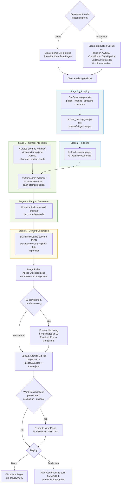

# Project Handoff Guide

> **For whoever is taking this over.** This document explains the full system — what it does, how it's structured, how the code is organized, and how to keep working on it effectively.

---

## Table of Contents

1. [What This System Does](#1-what-this-system-does)
2. [High-Level Architecture](#2-high-level-architecture)
3. [Repository Layout](#3-repository-layout)
4. [How the Pipeline Works](#4-how-the-pipeline-works)
5. [Deployment Targets: Demo vs Production](#5-deployment-targets-demo-vs-production)
6. [The Full Workflow (End-to-End)](#6-the-full-workflow-end-to-end)
7. [Frontend Deep Dive](#7-frontend-deep-dive)
8. [Backend Deep Dive](#8-backend-deep-dive)
9. [Key Data Structures](#9-key-data-structures)
10. [Critical Patterns You Must Know](#10-critical-patterns-you-must-know)
11. [How to Run the Project Locally](#11-how-to-run-the-project-locally)
12. [Quality Checks & Testing](#12-quality-checks--testing)
13. [Configuration & Environment](#13-configuration--environment)
14. [Known Gotchas & Pre-existing Issues](#14-known-gotchas--pre-existing-issues)
15. [How to Add a New Workflow Step](#15-how-to-add-a-new-workflow-step)
16. [How to Add a New Site Template](#16-how-to-add-a-new-site-template)
17. [External Services](#17-external-services)
18. [History of Major Changes](#18-history-of-major-changes)

---

## 1. What This System Does

This is a **web agency automation tool** — specifically built to help create and deploy websites for dental/orthodontic practices (and similar local businesses).

The operator enters a client's existing website domain. The system then:

1. **Scrapes** the client's existing website (text, images, page structure)
2. **Indexes** the scraped content into an OpenAI vector store
3. **Selects** a site template (currently: "Stinson" — a dental practice template)
4. **Allocates** scraped content to sections of the template's sitemap
5. **Generates** AI-written content for every section, page, and global element
6. **Picks** images (either from a licensed stock library or the client's existing site)
7. **Uploads** the finished JSON data to a GitHub repository
8. **Deploys** the site via AWS (S3 + CloudFront + CodePipeline) or Cloudflare Pages
9. **Optionally** pushes content into a WordPress backend

Everything is driven from a React UI called the **Unified Workflow**. The user walks through ordered steps, can pause/edit between steps, and can run in "Yolo mode" (fully automated, no pauses).

---

## 2. High-Level Architecture

```
┌────────────────────────────────────────────────────┐
│              Browser (React + Vite)                │
│   /workspace/template-manager-ui/                  │
│                                                    │
│  UnifiedWorkflow UI  ←→  UnifiedWorkflowProvider   │
│       (steps, panels, editor)        (state)       │
│                                                    │
│  useWorkflowStepRunner  →  step runner files       │
│  (orchestrates execution)    (one per step)        │
└────────────────┬───────────────────────────────────┘
                 │  HTTP (axios)
                 ▼
┌────────────────────────────────────────────────────┐
│         FastAPI Backend (Python)                   │
│  /workspace/ContentGenerationAndDistribution/      │
│                                                    │
│  app/api/routes.py   ← all endpoints live here    │
│  app/services_new/   ← all business logic         │
│  app/schemas/        ← Pydantic models + sitemaps  │
│  app/config.py       ← global config / API keys   │
└────────────────────────────────────────────────────┘
         │           │            │
         ▼           ▼            ▼
     OpenAI      Firecrawl     GitHub
   (content gen,  (web scraping) (repo mgmt)
   vector store)
         │
         ▼
     AWS / Cloudflare / WordPress
     (deployment targets)
```

The two repos (`template-manager-ui/` and `ContentGenerationAndDistribution/`) are siblings under `/workspace/`. Each has its own git history; **commit inside the sub-repo, not at the workspace root**.

---

## 3. Repository Layout

### `/workspace/` (workspace root — not a git repo)

| Path | Purpose |
|------|---------|
| `prd.json.example` | Example PRD format (actual `prd.json` is gitignored) |
| `template-manager-ui/` | React frontend |
| `ContentGenerationAndDistribution/` | Python backend |
| `docs/` | Supplementary docs |
| `*.md` files | Feature-specific docs written during development |

### `template-manager-ui/src/` (frontend)

| Path | Purpose |
|------|---------|
| `components/UnifiedWorkflow/` | All the main UI panels and step display |
| `hooks/workflow/` | `useWorkflowStepRunner.ts` (orchestrator) |
| `hooks/workflow/stepRunners/` | One file per workflow step (19 steps) |
| `constants/stepInputMappings.ts` | **STEP_DATA_CONTRACT** — single source of truth for step I/O |
| `constants/workflowSteps.ts` | Step definitions, ordering, AVAILABLE_TEMPLATES |
| `contexts/UnifiedWorkflowProvider.tsx` | Global state (React context + reducer) |
| `contexts/workflowReducer.ts` | Reducer, defaultSiteConfig, initial state |
| `types/UnifiedWorkflowTypes.ts` | All TypeScript interfaces |
| `types/APIServiceTypes.ts` | Request/response types for API calls |
| `services/` | Axios API call wrappers |
| `siteTemplates.ts` | Template definitions, sitemap imports, `injectPreserveImageFlags()` |

### `ContentGenerationAndDistribution/app/` (backend)

| Path | Purpose |
|------|---------|
| `api/routes.py` | **All FastAPI endpoints** (~7500 lines) |
| `config.py` | Global config (API keys, model name, env vars) |
| `schemas/_site_configs/sitemap/` | `stinson-sitemap.json` — THE sitemap template |
| `schemas/_site_configs/static_models/stinson/` | Pydantic models for Stinson content |
| `services_new/content_generation/` | Sitemap generation, content generation, prompts |
| `services_new/data_processing/scraping/` | Firecrawl scraping logic |
| `services_new/site_management/` | GitHub, AWS provisioning, WordPress |
| `pipeline_tests/` | CLI test runner for validating AI output |

---

## 4. How the Pipeline Works

The core of this system is a **5-stage content pipeline** that transforms a client's existing website into a fully generated, deployable site. Understanding this pipeline is essential before reading the step-by-step workflow tables in Section 6.



### Stage 1 — Scraping (`runScrapeSite.ts` → `/scrape-site/start/`)

FireCrawl hits the source site and returns: `pages` (keyed by URL), `global_markdown`, and `style_overview`. It uses `rawHtml` format (not the default `html`) to preserve sidebar content that the standard cleaned-HTML output strips. A `recover_missing_images()` pass runs afterward to catch any images present in raw HTML but missing from the markdown output — typically widget images and nav logos.

Config options: `useFirecrawl` (toggle), `use_selenium` (fallback for bot-blocked sites), `scroll` (trigger lazy-loaded content), `maxScrapePages` (default 50).

### Stage 2 — Indexing (`runCreateVectorStore.ts` → `/create-vector-store/start/`)

The scraped pages are uploaded as files to an **OpenAI vector store**. This enables semantic file search in Stage 3 — OpenAI's file search API is vector-based under the hood but gives structured retrieval semantics rather than raw embedding distances. The returned `vector_store_id` is threaded through to Stage 3.

If you already have a vector store from a previous run (e.g., re-running content generation without re-scraping), you can import the existing ID and skip this step.

### Stage 3 — Content Allocation (`runAllocateContent.ts` → `/allocate-content-second-pass/start/`)

This is the core intelligence step. The curated sitemap template (`stinson-sitemap.json`) defines what every page and section expects, providing `model_query_pairs` — semantic queries like "doctor profile photos" or "list of dental services offered". The allocator runs those queries against the vector store and returns `allocated_markdown`: actual scraped text and image URLs matched to each sitemap section.

`preserve_image` flags are injected per-section here. Sections marked `preserve_image: true` (doctor headshots, team photos, office tours) will keep the client's originals through all subsequent stages.

### Stage 4 — Sitemap Generation (`runGenerateSitemap.ts` → `/generate-sitemap-from-scraped/start/`)

Takes the allocated content and produces the **final structured sitemap** in strict template mode — no creative structure invention; the template defines the page/section hierarchy and the LLM only fills in the content slots. If no scrape data is present (user imported an existing vector store), this step passes through the allocated sitemap directly without an API call.

### Stage 5 — Content Generation (`runGenerateContent.ts` → `/generate-content-for-scraped/start/` + `/generate-global/start/`)

The LLM fills in structured JSON within the Pydantic schema for every section of every page, plus global site data (navigation, footer, contact details). Both endpoints run in parallel. The schema rigidity is intentional — consistent, publishable output with no free-form structure invention. Post-processing re-injects `preserve_image` flags from the sitemap to ensure they survive backend processing.

### Post-processing: Image Picker (`runImagePicker.ts` → `/adobe/image-agent/find-images/start/`)

Finds all image slots in the generated content, skips any with `preserve_image: true`, and calls the Adobe Stock image agent in batches of 20. Auto-selects the first unused image per slot. Generates ImageKit WebP variants at appropriate dimensions.

### Post-processing: Hotlink Prevention (`runPreventHotlinking.ts` → `/sync-scraped-images/start/`) — *production only*

Syncs all images to S3 and rewrites every URL to CloudFront CDN. Returns three updated data blobs (`hotlinkPagesResult`, `hotlinkGlobalDataResult`, `hotlinkThemeResult`) that take priority over the raw content in the upload step.

### Image Strategy Summary

| Strategy | When used | How |
|----------|-----------|-----|
| **Hot-link client's images** | Demo / JSON deployments | URLs point directly to the client's existing site — zero storage cost |
| **Re-upload to S3** | Production AWS deployments | Prevent Hotlinking step syncs to S3, rewrites to CloudFront |
| **Adobe Stock** | Non-preserved image slots | Image Picker replaces slots with licensed stock images |
| **`preserve_image` flag** | Doctor headshots, team photos, office tours | Skips the slot in Image Picker; flag re-injected after content generation |

---

## 5. Deployment Targets: Demo vs Production

The **single most important configuration choice** in the UI is the **Deployment Target** dropdown in `ConfigurationPanel`. It controls which steps run.

```
ConfigurationPanel → siteConfig.deploymentTarget: 'demo' | 'production'
```

This value is read by `useYoloMode.ts` → `getExecutionOrderByTarget()` → returns the correct ordered step list. Steps not in that list are treated as skipped.

---

### Demo Mode (default — `deploymentTarget: 'demo'`)

**What it is:** A fast preview/staging path. Content is generated and pushed as JSON files to a GitHub repo, then deployed to **Cloudflare Pages** for quick previewing. No AWS infrastructure, no WordPress.

**When to use it:** Always use this first. Show the client a live URL before committing to production provisioning.

**Steps that run (in order):**

| # | Step | Step Runner | Notes |
|---|------|-------------|-------|
| 1 | Create Demo Repo | `runCreateDemoRepo.ts` | Creates a repo in the demo-rooster org from the roostergrin template |
| 2 | Scrape Site | `runScrapeSite.ts` | Firecrawl-scrapes the client's domain |
| 3 | Create Vector Store | `runCreateVectorStore.ts` | Indexes scraped pages in OpenAI |
| 4 | Select Template | `runSelectTemplate.ts` | User picks a site template |
| 5 | Allocate Content | `runAllocateContent.ts` | Maps scraped content → sitemap sections |
| 6 | Generate Sitemap | `runGenerateSitemap.ts` | Produces the final sitemap |
| 7 | Generate Content | `runGenerateContent.ts` | LLM generates all page + global content |
| 8 | Download Theme | `runDownloadTheme.ts` | Extracts color/font theme from client's site |
| 9 | Image Picker | `runImagePicker.ts` | User picks/approves images |
| 10 | Upload JSON to GitHub | `runUploadJsonToGithub.ts` | Single commit: pages.json + globalData.json + theme.json |
| 11 | Provision Cloudflare Pages | `runProvisionCloudflarePages.ts` | Creates Cloudflare Pages project + connects to GitHub repo |

**Skipped in demo mode:** Create GitHub Repo, Provision WordPress Backend, Provision Site (AWS), Prevent Hotlinking, Export to WordPress, Second Pass, Upload Logo, Upload Favicon.

---

### Production Mode (`deploymentTarget: 'production'`)

**What it is:** The full production deployment path. Provisions real AWS infrastructure (S3, CloudFront, CodePipeline), optionally exports to WordPress, and handles image hotlink prevention.

**When to use it:** After client approval of the demo site. This provisions the real infrastructure.

**Steps that run (in order):**

| # | Step | Step Runner | Notes |
|---|------|-------------|-------|
| 1 | Create GitHub Repo | `runCreateGithubRepo.ts` | Creates the production repo from a template |
| 2 | Provision WordPress Backend | `runProvisionWordPressBackend.ts` | Copies Plesk/WP subscription (WordPress templates only — often skipped) |
| 3 | Provision Site | `runProvisionSite.ts` | AWS: S3, CloudFront distributions, CodePipeline |
| 4 | Scrape Site | `runScrapeSite.ts` | Firecrawl-scrapes the client's domain |
| 5 | Create Vector Store | `runCreateVectorStore.ts` | Indexes scraped pages in OpenAI |
| 6 | Select Template | `runSelectTemplate.ts` | User picks a site template |
| 7 | Allocate Content | `runAllocateContent.ts` | Maps scraped content → sitemap sections |
| 8 | Generate Sitemap | `runGenerateSitemap.ts` | Produces the final sitemap |
| 9 | Generate Content | `runGenerateContent.ts` | LLM generates all page + global content |
| 10 | Download Theme | `runDownloadTheme.ts` | Extracts color/font theme from client's site |
| 11 | Image Picker | `runImagePicker.ts` | User picks/approves images |
| 12 | Prevent Hotlinking | `runPreventHotlinking.ts` | Syncs images to ImageKit; prevents direct hotlink to client's origin |
| 13 | Upload JSON to GitHub | `runUploadJsonToGithub.ts` | Single commit: pages.json + globalData.json + theme.json |
| 14 | Export to WordPress | `runExportToWordPress.ts` | Pushes content to WP ACF fields via REST API (optional) |
| 15 | Second Pass | `runSecondPass.ts` | Fixes IDs, accessibility, image sizes in WordPress (optional) |
| 16 | Upload Logo | `runUploadLogo.ts` | Uploads PNG logo with header color detection |
| 17 | Upload Favicon | `runUploadFavicon.ts` | Uploads site favicon |

**Skipped in production mode:** Create Demo Repo, Provision Cloudflare Pages.

---

### How the Mode Switch Works in Code

`siteConfig.deploymentTarget` is set via `ConfigurationPanel.tsx`. When Yolo mode runs:

```typescript
// useYoloMode.ts
const deploymentTarget = currentConfig.deploymentTarget || 'demo';
const executionOrder = getExecutionOrderByTarget(deploymentTarget);
// → calls getDemoExecutionOrder() or getYoloExecutionOrder() from workflowSteps.ts
```

Steps not in the execution order are automatically treated as skipped (their dependencies are considered met). The `DEFAULT_WORKFLOW_STEPS` in `workflowSteps.ts` sets each step's initial status: demo-only steps start as `pending`, production-only steps start as `skipped` — this is the default.

Individual steps can also be toggled manually with `actions.skipStep(id)` / `actions.enableStep(id)`, overriding the target-based defaults.

---

## 6. The Full Workflow (End-to-End)

All steps that exist in the system — across both modes. See Section 5 for which steps are active in each mode.

| Step | Step Runner | Key API Endpoint | What It Does | Demo | Production |
|------|-------------|-----------------|-------------|------|-----------|
| Create GitHub Repo | `runCreateGithubRepo.ts` | `/create-github-repo-from-template/` | Creates client's production repo | — | ✓ |
| Provision WordPress Backend | `runProvisionWordPressBackend.ts` | `/copy-subscription/` | Copies WP/Plesk subscription | — | optional |
| Provision Site | `runProvisionSite.ts` | `/provision/` | AWS: S3 + CloudFront + CodePipeline | — | ✓ |
| Create Demo Repo | `runCreateDemoRepo.ts` | `/create-demo-repo/` | Creates demo repo in demo-rooster org | ✓ | — |
| Scrape Site | `runScrapeSite.ts` | `/scrape-site/` | Firecrawl-scrapes the client's domain | ✓ | ✓ |
| Create Vector Store | `runCreateVectorStore.ts` | `/create-vector-store/` | Indexes scraped pages in OpenAI | ✓ | ✓ |
| Select Template | `runSelectTemplate.ts` | (local) | User picks a site template | ✓ | ✓ |
| Allocate Content | `runAllocateContent.ts` | `/allocate-content-second-pass/` | Maps scraped content → sitemap sections | ✓ | ✓ |
| Generate Sitemap | `runGenerateSitemap.ts` | `/generate-sitemap-from-scraped/` | Produces the final sitemap | ✓ | ✓ |
| Generate Content | `runGenerateContent.ts` | `/generate-content-for-scraped/` + `/generate-global/` | LLM generates all page + global content | ✓ | ✓ |
| Download Theme | `runDownloadTheme.ts` | (scraping) | Extracts color/font theme from client's site | ✓ | ✓ |
| Image Picker | `runImagePicker.ts` | (UI only) | User picks/approves hero images | ✓ | ✓ |
| Prevent Hotlinking | `runPreventHotlinking.ts` | `/replace-images-with-imagekit/` | Syncs images to ImageKit CDN | — | ✓ |
| Upload JSON to GitHub | `runUploadJsonToGithub.ts` | `/batch-update-github-repo-files/` | Single commit: pages.json + globalData.json + theme.json | ✓ | ✓ |
| Export to WordPress | `runExportToWordPress.ts` | `/update-wordpress/` + `/update-wordpress-global/` | Pushes content to WP ACF fields | — | optional |
| Second Pass | `runSecondPass.ts` | `/allocate-content-second-pass/` | Fixes IDs, accessibility, image sizes in WP | — | optional |
| Upload Logo | `runUploadLogo.ts` | `/update-github-repo-file-upload/` | Uploads PNG logo with header color detection | — | optional |
| Upload Favicon | `runUploadFavicon.ts` | `/update-github-repo-file-upload/` | Uploads site favicon | — | optional |
| Provision Cloudflare Pages | `runProvisionCloudflarePages.ts` | `/provision-cloudflare-pages/` | Creates Cloudflare Pages project + connects GitHub | ✓ | — |

**✓** = runs by default in this mode. **optional** = in the execution order but often manually skipped. **—** = skipped.

---

## 7. Frontend Deep Dive

### State Management

All workflow state lives in `UnifiedWorkflowProvider.tsx` (React context). The state shape is defined in `UnifiedWorkflowTypes.ts`:

- **`siteConfig`** — client config (domain, template, GitHub owner/repo, contentModel, etc.)
- **`steps`** — array of step objects with status (`pending` / `in_progress` / `completed` / `skipped` / `error`)
- **`generatedData`** — keyed object where each step writes its output (e.g., `generatedData.scrapeResult`, `generatedData.sitemapResult`)
- **`logs`** — streaming log messages shown in the UI

The reducer (`workflowReducer.ts`) handles all state transitions via dispatched actions defined in `UnifiedWorkflowActions`.

### Step Data Contract

**The most important pattern in the frontend is `STEP_DATA_CONTRACT`** in `src/constants/stepInputMappings.ts`.

Every workflow step has an entry declaring:
- `inputs`: which `generatedData` keys it reads
- `outputs`: which `generatedData` keys it writes
- `primaryOutputKey`: the main key (used for the Edit/Save panel)
- `editable`: whether the user can edit the output before proceeding
- `description`: shown in the UI

When you add a new step, you add one entry here and all helpers (`getStepOutputKey`, `getStepEditData`, `getStepInputData`, `isStepEditable`) work automatically.

**Critical distinction:**
- `getStepEditData(step, generatedData)` → returns the step's **own** output (for Edit/Save panel)
- `getStepInputData(step, generatedData)` → returns **upstream** input (for pre-step editing in Yolo mode)

Never conflate these. Mixing them up causes wrong data to be saved under wrong keys.

### Step Runner Pattern

Each step runner in `stepRunners/` is a function that receives `StepRunnerDeps` (which extends `UnifiedWorkflowActions`) and performs the API call + state updates.

`useWorkflowStepRunner.ts` is the orchestrator: it maps step names to their runner functions and handles:
- Setting step status to `in_progress`
- Calling the runner
- Setting step status to `completed` or `error`
- Abort signal propagation

### UI Components

The main panels in `UnifiedWorkflow/`:

| Component | Purpose |
|-----------|---------|
| `UnifiedWorkflow.tsx` | Top-level layout, step selection, pre-step editing |
| `WorkflowProgressDisplay.tsx` | Step list with status indicators, Edit/Save controls |
| `WorkflowControlBar.tsx` | Run/Pause/Yolo controls |
| `ConfigurationPanel.tsx` | siteConfig fields (domain, template, model, speed settings) |
| `InputEditorPanel.tsx` | JSON editor for editing step output/input |
| `BatchModePanel.tsx` | Bulk CSV upload for running multiple sites |
| `*EditorPanel.tsx` | Step-specific editors (Sitemap, Content, etc.) |

---

## 8. Backend Deep Dive

### Entry Point

`app/api/routes.py` — one giant file (~7500 lines) containing every FastAPI endpoint. This is the backend's single entry point.

### Async Job Pattern

Most long-running endpoints have two variants:
- `/endpoint/` — synchronous (waits for result)
- `/endpoint/start/` — starts an async job, returns a `job_id`

The frontend polls `/async-job/status/{job_id}` until complete. The step runners handle this internally.

### Content Generation Pipeline

```
stinson-sitemap.json
       ↓
rag_sitemap_generator.py     (generates section-specific search queries)
       ↓
content_allocator.py         (runs vector search, allocates content per section)
       ↓
openai_file_search.py        (queries the vector store)
       ↓
prompt_builder.py            (builds the system prompt for LLM)
       ↓
content.py / sitemap.py      (calls OpenAI, validates via Pydantic)
       ↓
pages.json + globalData.json (output)
```

### Pydantic Models (Content Schema)

Each site template has Pydantic models in `app/schemas/_site_configs/static_models/{template}/`.

For Stinson: `stinson.py` defines every section type (Hero, MultiUseBanner, PrimaryCTA, etc.) with field descriptions that guide the LLM's output. **The field descriptions are prompt instructions** — they tell the LLM what to write.

### Stinson Sitemap

`app/schemas/_site_configs/sitemap/stinson-sitemap.json` is the **single source of truth** for what pages and sections the Stinson template has.

The frontend imports it directly via a cross-repo relative path (Vite resolves this without special config):
```typescript
// in siteTemplates.ts
import rawSitemap from '../../ContentGenerationAndDistribution/app/schemas/_site_configs/sitemap/stinson-sitemap.json'
```

The `preserve_image` field is computed at import time by `injectPreserveImageFlags()` — this mirrors the backend's `_should_preserve_image()` logic. **If you change the backend logic, update the frontend wrapper too.**

### Config

`app/config.py` holds all global settings: API keys (OpenAI, GitHub, Firecrawl, etc.), `MODEL_NAME` (the default LLM model), and environment flags.

Per-request model overrides work by mutating `config_module.MODEL_NAME` and restoring after. This is the current pattern (not ideal, but it works).

### Middleware Ordering (Critical)

Starlette's `add_middleware()` uses `insert(0, ...)` — **last registered = outermost layer**.

Current order (correct):
```
ServerErrorMiddleware → CORSMiddleware → Auth middleware → SessionMiddleware → Router
```

CORSMiddleware must be registered **after** the auth middleware in `routes.py` so that CORS headers are added to error responses too. If you touch middleware registration order, be careful.

### Production Deployment (AWS Lightsail)

The backend runs as a Docker container on **AWS Lightsail Container Services**.

**Live container dashboard:**
https://lightsail.aws.amazon.com/ls/webapp/us-west-2/container-services/automation-tools/deployments

**How deployments work:**

Deployments are triggered automatically on every push to `main`, or manually via GitHub Actions (`workflow_dispatch`). The workflow is `.github/workflows/lightsail-deploy.yml` in `ContentGenerationAndDistribution/`.

```
Push to main (or manual dispatch)
        │
        ▼
GitHub Actions builds Docker image
        │
        ▼
aws lightsail push-container-image
(pushes image to Lightsail's private registry)
        │
        ▼
Workflow builds containers.json using jq —
this is where GitHub Secrets become container env vars
        │
        ▼
aws lightsail create-container-service-deployment
(new deployment goes live; old one replaced)
```

The critical step is the `jq` block that constructs `containers.json` — every secret that needs to reach the app must be listed there explicitly. If you add a new secret to GitHub but forget to add it to this block, it will never reach the container.

**To trigger a manual redeploy:**

GitHub → Actions tab → "Deploy to Lightsail" → Run workflow → select branch → Run.

**To check what's running:**

The Lightsail dashboard (link above) shows current and previous deployments, container health, and logs. Logs are also accessible via:
```bash
aws logs tail /aws/lightsail/automation-tools --follow --region us-west-2
```

**To add a new environment variable to production** — three files must all be updated:

1. **GitHub Secrets** — add via repo Settings → Secrets and variables → Actions
2. **`app/config.py`** — `MY_VAR = os.environ.get("MY_VAR")`
3. **`lightsail-deploy.yml`** — add to the `jq` `--arg` list and to the JSON `environment` block

Missing any one of these means the variable won't reach the app.

**Note on the frontend deployment:** The frontend uses a separate path — AWS CodeBuild reads `buildspec.yml`, runs `npm run build:prod`, and the `dist/` output is deployed to S3/CloudFront via CodePipeline. This is completely independent of the Lightsail backend deployment.

---

## 9. Key Data Structures

### `SiteConfig` (frontend)

Defined in `UnifiedWorkflowTypes.ts`. Key fields:

```typescript
{
  domain: string,           // "example.com"
  scrapeDomain: string,     // domain to scrape (may differ from deploy domain)
  template: string,         // "stinson"
  githubOwner: string,
  githubRepo: string,
  contentModel: 'gpt-5-mini' | 'gpt-5-nano',
  homePageOnly: boolean,    // generate only the home page (faster)
  enableImagePicker: boolean,
  // ... more
}
```

### `generatedData` (frontend)

The runtime data store — keyed by output key:

```typescript
{
  scrapeResult: ScrapeSiteResult,
  vectorStoreResult: CreateVectorStoreResult,
  templateResult: SelectTemplateResult,
  allocatedSitemap: AllocateContentResult,
  sitemapResult: GenerateSitemapResult,
  contentResult: GenerateContentResult,
  themeResult: DownloadThemeResult,
  githubRepoResult: CreateGithubRepoResult,
  // ... etc
}
```

### Sitemap JSON structure

The sitemap JSON has pages, each with sections. Each section has:
- `internal_id` — must be globally unique across the sitemap
- `model` — the Pydantic model name to use for this section
- `queries` — example search queries (fed to LLM as examples for generating site-specific queries)
- `preserve_image` — whether to keep the existing site's image for this section

---

## 10. Critical Patterns You Must Know

### 1. Three-Layer LLM Output Control

To control what the LLM writes for any field, you must reinforce it at **all three layers**:
1. **Pydantic field description** in `stinson.py` — the schema-level instruction
2. **Sitemap query** in `stinson-sitemap.json` — what the vector search fetches
3. **System prompt** in `prompt_builder.py` — explicit rule in the prompt

If only one layer says it, the LLM will often ignore it.

### 2. Batch Upload (Single Commit)

`runUploadJsonToGithub.ts` uses `/batch-update-github-repo-files/` to upload all JSON files in a single git commit. This replaced the old approach of 3 separate commits.

Types: `BatchUploadGithubFilesRequest` / `BatchUploadGithubFilesResponse` in `APIServiceTypes.ts`.

### 3. Idempotency Logging Pattern

After any API call that supports `already_existed`, log the result before returning:
```typescript
if (response.already_existed) {
  logger.logProcessing('Thing already existed: ' + name)
} else {
  logger.logProcessing('Thing newly created: ' + name)
}
```

### 4. Firecrawl Scraping

- Use `rawHtml` format (not `html`) to get sidebar content
- SDK returns `raw_html` (underscore), API dict returns `rawHtml` (camelCase) — handle both
- `recover_missing_images()` in `scrape_site.py` catches images that appear in raw HTML but not markdown

### 5. Adding a New Step

See [Section 15](#15-how-to-add-a-new-workflow-step) for the full checklist.

---

## 11. How to Run the Project Locally

### Frontend

```bash
cd /workspace/template-manager-ui
npm install
npm run dev         # development mode (points to dev backend)
npm run dev:prod    # production mode
```

### Backend

```bash
cd /workspace/ContentGenerationAndDistribution
# Activate venv
source venv/bin/activate   # or venv-local/bin/activate

# Run the FastAPI server
uvicorn app.api.routes:app --reload --port 8000

# Or via Docker:
docker-compose up
```

The frontend's Vite config sets the API base URL based on the mode. Check `template-manager-ui/src/config/` or `.env` files for the backend URL configuration.

### Pipeline Tests (Backend, no browser needed)

```bash
cd /workspace/ContentGenerationAndDistribution
python3 -m pipeline_tests check-defaults    # validate Pydantic schemas (free)
python3 -m pipeline_tests check-prompts     # validate prompt content (free)
python3 -m pipeline_tests smoke-sitemap     # generate a sitemap (1 API call)
python3 -m pipeline_tests smoke-page Home   # generate home page content (1 API call)
python3 -m pipeline_tests smoke-global      # generate global data (1 API call)
```

---

## 12. Quality Checks & Testing

### Frontend

Run these from `template-manager-ui/`:

```bash
npx tsc --noEmit       # TypeScript check (no dedicated npm script)
npm run lint           # ESLint
npx vitest run         # Run all tests
```

**Pre-existing issues to ignore:**
- Lint errors in `useWorkflowStepRunner.ts` and `ragService.ts`
- Test failures in `GenerateSitemapButton.test.tsx`

These are known pre-existing issues unrelated to any recent changes. Don't fix them unless specifically tasked.

### Backend

```bash
cd /workspace/ContentGenerationAndDistribution
pytest tests/                           # full test suite
pytest tests/unit_new/                  # unit tests only
python3 -m pipeline_tests check-defaults
```

---

## 13. Configuration & Environment

### Backend (`app/config.py`)

Key environment variables (set in `.env` or deployment environment):

| Variable | Purpose |
|----------|---------|
| `OPENAI_API_KEY` | OpenAI API (content generation, vector stores) |
| `GITHUB_TOKEN` | GitHub API (repo creation, file uploads) |
| `FIRECRAWL_API_KEY` | Firecrawl (web scraping) |
| `AWS_ACCESS_KEY_ID` / `AWS_SECRET_ACCESS_KEY` | AWS provisioning |
| `CLOUDFLARE_API_TOKEN` | Cloudflare Pages deployment |
| `IMAGEKIT_*` | ImageKit (image hosting, hotlink prevention) |
| `SECRET_KEY` | Session middleware secret |
| `ALLOWED_API_KEYS` | Auth middleware (comma-separated) |

### Frontend

The frontend has **no runtime config server** — all environment variables are baked into the JS bundle at build time by Vite. Whatever is in the `.env.*` file when `npm run build` runs becomes a literal string in the compiled output. Changing an env var requires a rebuild and redeploy.

#### Environment files

| File | When used | Gitignored? |
|------|-----------|-------------|
| `.env.development` | `npm run dev` | No — committed |
| `.env.production` | `npm run build` / `npm run build:prod` | No — committed |
| `.env.local` | Always, overrides both above | Yes — never committed |

`.env.local` is the right place for personal overrides (e.g. pointing your local dev server at the production backend). Never put real secrets in `.env.development` or `.env.production` — those are committed to the repo.

#### Environment variables

| Variable | Purpose |
|----------|---------|
| `VITE_API_BASE_URL` | Backend URL (e.g. `https://automation-tools.wjj7y49t8p9c2.us-west-2.cs.amazonlightsail.com/`) |
| `VITE_INTERNAL_API_KEY` | API key sent as `X-API-Key` header on every request — must match `ALLOWED_API_KEYS` on the backend |
| `VITE_INTERNAL_API_TOKEN` | Alias for `VITE_INTERNAL_API_KEY` (either works; key takes precedence if both set) |
| `VITE_CLOUDFRONT_IMAGE_DOMAIN` | CloudFront domain used when rewriting image URLs post-hotlink-prevention |

All `VITE_*` variables are exposed to browser code via `import.meta.env`. Non-prefixed variables are never sent to the browser.

#### How the API key is resolved at runtime

`apiService.ts` checks these sources in order, using the first non-empty value:

1. **In-memory** — set by `setInMemoryInternalApiKey()` (called by the TokenGate UI on login)
2. **`VITE_INTERNAL_API_KEY` / `VITE_INTERNAL_API_TOKEN`** — baked in at build time
3. **`null`** — request is sent without an `X-API-Key` header (backend will reject it)

This means users can also paste their API key directly into the **TokenGate UI** at runtime — it gets stored in `localStorage` and passed to `setInMemoryInternalApiKey()` on next load. This is the normal flow for anyone who doesn't have the key baked into their build.

#### How to update env vars

**For local development:**
```bash
# Edit .env.development (or .env.local for personal overrides)
VITE_API_BASE_URL=http://localhost:8000/
VITE_INTERNAL_API_KEY=your_key_here
# Then restart: npm run dev
```

**For production (AWS CodeBuild):**

The production build runs through **AWS CodePipeline → CodeBuild** (`buildspec.yml`). CodeBuild runs `npm run build:prod`, which reads `.env.production`. Environment variables that shouldn't be committed (like the actual API key value) must be set as **CodeBuild environment variables** in the AWS Console:

1. Go to AWS Console → CodeBuild → your project → Edit → Environment
2. Add environment variables under "Additional configuration"
3. For secrets, use **AWS Secrets Manager** or **Parameter Store** and reference them as `SECRETS_MANAGER` type — don't paste secrets as plaintext in the console
4. Trigger a new build (or push to the watched branch) — CodePipeline will pick it up automatically

**GitHub Actions (`ci.yml`) does not deploy** — it only runs lint, tests, and a build check. No GitHub secrets are needed or used for deployment. If you ever wire up GitHub Actions to deploy directly, you would add secrets under GitHub repo Settings → Secrets and variables → Actions, then reference them as `${{ secrets.MY_SECRET }}` in the workflow YAML.

**For Cloudflare Pages demo sites:**

Demo sites are built locally by the workflow step runner and the pre-built `dist/` files are pushed directly to the demo GitHub repo. Cloudflare Pages just serves those static files — it does not run a build. So no Cloudflare environment variables are needed; the backend URL and API key are already baked into the bundle before it's pushed.

---

## 14. Known Gotchas & Pre-existing Issues

1. **`useWorkflowStepRunner.ts` is enormous** (~2000+ lines). It orchestrates all step runners. Be careful editing it — pre-existing lint errors exist on lines 38, 182, 659, 671, 999, 1052.

2. **`routes.py` is enormous** (~7500 lines). All backend endpoints are in one file by design (legacy decision).

3. **`injectPreserveImageFlags()`** in `siteTemplates.ts` must stay in sync with `_should_preserve_image()` in `rag_sitemap_generator.py`. If backend logic changes, update the frontend too.

4. **Cross-repo JSON import**: `siteTemplates.ts` imports directly from the backend path via `../../ContentGenerationAndDistribution/...`. This works in Vite without special config but would break if the repos move.

5. **Model name mutation**: The backend mutates `config_module.MODEL_NAME` per-request and restores it. This is not thread-safe under concurrent requests — but acceptable for the current single-user use case.

6. **No `python3` in some environments**: Use `python3` or just `python` depending on the environment. Pipeline tests require the backend venv.

7. **Internal IDs must be unique**: Every `internal_id` across the entire sitemap JSON must be unique. Duplicates cause silent bugs in content allocation.

8. **Starlette middleware ordering**: `add_middleware()` inserts at position 0, so last-added = outermost. The current order is correct — don't reorganize middleware registration.

---

## 15. How to Add a New Workflow Step

Follow these steps in order:

### Backend (if a new endpoint is needed)

1. Add the endpoint to `app/api/routes.py`
2. Add request/response Pydantic models to `app/api_models.py` or inline in routes
3. Add the async `start/` variant if the operation is long-running

### Frontend

1. **Add the step to `STEP_DATA_CONTRACT`** in `src/constants/stepInputMappings.ts`:
   ```typescript
   'my-new-step': {
     inputs: ['someUpstreamKey'],
     outputs: ['myNewStepResult'],
     primaryOutputKey: 'myNewStepResult',
     editable: true,
     description: 'What this step does',
   }
   ```

2. **Create the step runner** in `src/hooks/workflow/stepRunners/runMyNewStep.ts`

3. **Export it** from `src/hooks/workflow/stepRunners/index.ts`

4. **Register it** in `useWorkflowStepRunner.ts` — add to the step-name-to-runner map

5. **Add the step to `workflowSteps.ts`** with its display name, icon, and position

6. **Add types** to `UnifiedWorkflowTypes.ts` for the step's result interface

7. **Add API types** to `APIServiceTypes.ts` for the request/response

8. Add an API service function in `src/services/` if needed

---

## 16. How to Add a New Site Template

The system currently has one production template: **Stinson** (dental practice). Templates like `bayareaortho`, `calistoga`, etc. exist in the backend schemas but may not be fully wired up.

To add a new template:

### Backend

1. Create `app/schemas/_site_configs/static_models/{template}/` with Pydantic models
2. Create `app/schemas/_site_configs/sitemap/{template}-sitemap.json`
3. Register the template in `app/schemas/_site_configs/` config

### Frontend

1. Add the template to `siteTemplates.ts` — import the sitemap JSON and define the template object
2. Add to `AVAILABLE_TEMPLATES` in `workflowSteps.ts`

---

## 17. External Services

| Service | Used For | Where Configured |
|---------|----------|-----------------|
| **OpenAI** | Content generation (GPT), vector stores (embeddings + search) | `config.py` → `OPENAI_API_KEY` |
| **Firecrawl** | Web scraping (crawl + markdown conversion) | `config.py` → `FIRECRAWL_API_KEY` |
| **GitHub** | Repo creation, file uploads (JSON data, logos, favicons) | `config.py` → `GITHUB_TOKEN` |
| **AWS** | S3 (static hosting), CloudFront (CDN), CodePipeline (CI/CD) | `config.py` → `AWS_*` |
| **Cloudflare Pages** | Alternative deployment target (demo sites) | `config.py` → `CLOUDFLARE_*` |
| **ImageKit** | Image CDN (prevents hotlinking, resizing) | `config.py` → `IMAGEKIT_*` |
| **WordPress** | CMS target (push generated content to WP ACF fields) | Per-client credentials in siteConfig |
| **Adobe Stock** | Licensed image library (image picker feature) | `config.py` → `ADOBE_*` |

---

## 18. History of Major Changes

This section summarizes the significant work done, in chronological order.

### Feb 3, 2026 — US-001 to US-006: Core Stability
- Added `already_existed` idempotency field to GitHub repo, demo repo, and Cloudflare Pages step results
- Added logging that tells the user whether resources were newly created or already existed
- Defined `BatchUploadGithubFilesRequest/Response` types
- Refactored `runUploadJsonToGithub` to use a single batch commit (was 3 separate commits)

### Feb 5, 2026 — Stinson Sitemap Improvements
- Improved all query strings to explicitly request links and photos
- Made the backend `stinson-sitemap.json` the single source of truth (deleted duplicate frontend copy)
- Frontend now imports directly from the backend path via a cross-repo Vite import
- Added `injectPreserveImageFlags()` wrapper in `siteTemplates.ts`

### Feb 6, 2026 — Firecrawl Fix + Hero Title Brevity
- Fixed Firecrawl stripping sidebar images by adding `rawHtml` format + `recover_missing_images()`
- Enforced brief hero section titles at all three layers (Pydantic, sitemap query, system prompt)

### Feb 11, 2026 — US-007: Step Data Contract Refactor
- Replaced three separate mapping objects with a unified `STEP_DATA_CONTRACT`
- Added `getStepEditData` / `getStepInputData` helpers (previously conflated, causing data shape bugs)
- InputEditorPanel now shows "Produces: X · Requires: Y" instead of raw data path

### Feb 18, 2026 — Speed Settings
- Added model dropdown (`gpt-5-mini` / `gpt-5-nano`), home-page-only toggle, skip image picker toggle
- Added time estimate UI
- Backend: `GenerateContentRequest` now accepts optional `model` field with per-request override

### Feb 21, 2026 — CORS Fix
- Fixed missing CORS headers on error responses by reordering middleware registration
- Added global exception handler to ensure 500 errors also get CORS headers

### Mar 6, 2026 — Refactoring Phases 5–11
- Renamed `_config.py` → `config.py` across all 40+ backend imports
- Removed deprecated `siteType` field from `SiteConfig` (replaced by `template`)
- Flattened `StepRunnerDeps` — eliminated `deps.actions.xxx()` indirection
- Added barrel `index.ts` for `src/hooks/workflow/`
- Split `UnifiedWorkflowProvider.tsx` into provider + `workflowReducer.ts`
- Split `sitemap.py` into `sitemap.py` + `sitemap_validators.py`
- Renamed `modelGroups.ts` → `siteTemplates.ts`

---

## Where to Start

If you're new and want to orient yourself quickly:

1. **Open `src/constants/stepInputMappings.ts`** — understand the `STEP_DATA_CONTRACT`. This is the skeleton of the entire frontend workflow.

2. **Open `src/constants/workflowSteps.ts`** — see the ordered list of steps.

3. **Read `app/api/routes.py` lines 1–200** — understand the import structure, middleware setup, and auth pattern before touching any endpoint.

4. **Run `python3 -m pipeline_tests check-defaults`** from the backend — free, fast, tells you if the Pydantic models are healthy.

5. **Run `npx tsc --noEmit`** from the frontend — confirms TypeScript is happy before making changes.

Good luck.

If you're just getting started, see [ONBOARDING.md](ONBOARDING.md) for a suggested first week.
